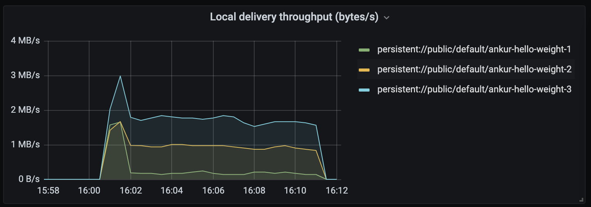
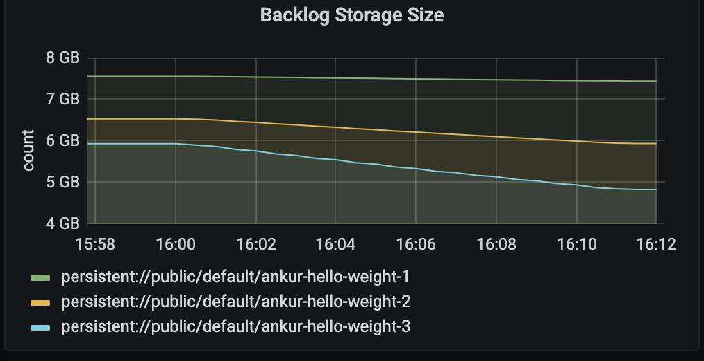
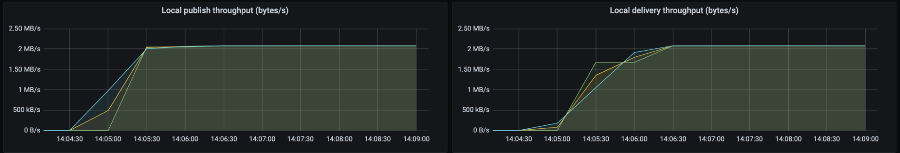

# Pulsar Weighted Consumer (PWC)

This repository provides implementation of a pulsar consumer that can do priority consumption across multiple topics. Topics and associated weights are supplied during consumer creation. The unequal consumption is done on a best effort basis and is best observed when all the input topics have sufficient backlog.

> Note: `WeightedMultiTopicsConsumerImpl` is a fork of the MultiTopicsConsumerImpl that ships with java pulsar-client. A neat extension of the same class is not possible at this moment since we need to change certain private members.

## Adding PWC to your build

### Dependency and Versioning
[Pulsar java client](https://pulsar.apache.org/docs/client-libraries-java/) should be added as a dependency in the maven project where you intend to import PWC. PWC builds are published follows a versioning scheme aligned with Pulsar: `major.minor-X`, where major.minor should be the same as the included pulsar client. Since pulsar clients are fully compatible across versions, it should be possible to use a different pulsar-client as compared to PWC, but this is neither tested nor recommended.

A good strategy would be to look at the PWC builds already available and align your pulsar-client to one of those versions.
```xml
<dependency>
    <groupId>com.flipkart.viesti</groupId>
    <artifactId>pulsar-weighted-consumer</artifactId>
    <version>2.7-1</version>
</dependency>
```

If you have a hard requirement of using a specific version of pulsar-client, but PWC has not been published for that pulsar verion, feel free to open a ticket.

### Snapshots

Snapshots of PWC are published using version as `major.minor-SNAPSHOT`. For example: `com.flipkart:pulsar-weighted-consumer:2.7-SNAPSHOT`

### Artifactory and Releases

Maven/Gradle releases are published to [clojars artifactory here](https://clojars.org/com.flipkart/pulsar-weighted-consumer). You need to have clojars repository added in your build file. Example for pom:
```xml
<repositories>
    <repository>
        <id>clojars</id>
        <name>Clojars repository</name>
        <url>https://clojars.org/repo</url>
    </repository>
</repositories>
```

You can also find more information about [changelog and releases here](https://github.com/flipkart-incubator/pulsar-weighted-consumer/releases).

TODO: javadocs link

## Learn about PWC

### Concepts

Pulsar weighted consumer modifies the original multi topic consumer and introduces unequal consumptions of messages across different topics. Multi topic consumer of Pulsar works by creating multiple topic specific consumers and draining messages from each of them to a shared queue. This shared queue in turn is drained by the user using `receive` method variants. PWC introduces few changes like keeping count of messages in the shared queue at a topic granularity and assigning weighted thresholds to the topics. Note that here a threshold or count is cumulatively applied to all partitions of a topic. When the message count breaches the topic's threshold, fetch of messages from its internal sub-consumer is paused. To ensure adherence to weights, it remains paused unless all the messages from the shared queue have not been drained (this is configurable though).

#### Bounds and Weights

The thresholds are determined by `minBound` which is associated with the lowest weighted topic and `maxBound` associate with the highest weighted topic. The thresholds for rest of the topics are calculated using the `distributionStrategy` specified. Consider an example of `minBound=100, maxBound=1000, distributionStrategy=LINEAR` and 5 topics associated with weights 1 to 5, respectively. Here the thresholds for the topics get computed as: `[100, 325, 550, 775, 1000]` which is essentially a linear increment of 225 messages between consecutive weights. Users can tweak minBound, maxBound, distributionStrategy and weights to arrive at the relative thresholds for messages of different topics in the shared queue. More the messages of a given topic in the shared queue, higher the consumption throughput for that topic (not true everytime though, refer to force priority consumption section). 

> **NOTE**   
> If w_max and w_min are the highest and lowest weights that you assign to the topics and if `w_max - w_min < 10`, it is recommended to not change the minBound and maxBound defaults.

#### Bursting

Although the fetch of messages from subconsumer is paused, the subconsumer can continue to fetch messages independently over the network from the broker, as per its receiver queue size. Since network I/O is significantly costlier than the local subconsumer to main consumer fetch, the pause of an internal topic consumer does not introduce a measurable penalty. 

The above design becomes relevant when you have few high throughput topics of lesser priority (smaller threshold) in tandem with low throughput topics of higher priority. What we do not want is a behaviour where high throughput topics are artificially penalized and overall consumption rate to remain low despite the consumer having capacity to process more messages. PWC exhibits the behaviour of bursting where if high priority topics do not have enough messages available, overall consumption rate does not suffer and lower priority topics can burst.

#### Force Priority Consumption

A side effect of having support for bursting is that when you have enough messages to consume across all topics and message processing is near instantaneous on the local consumer (think of printing message or incrementing a counter and subsequently acking), then all the topics regardless of weights assigned will show a high and near-equal consumption rate. This may be the desired behaviour in majority of the situations where weights do no matter much if local message processing is much faster than the cost to fetch the messages in the first place over the network.

But if in situations like above, strict priority consumption is required, then a separate flag `throttleReceieverQueue` can be enabled which applies weighted thresholds even to the messages fetched by specific topic consumers from the brokers. Usage of this flag should only be done in very specific scenarios, and you are almost always better off leaving this untouched because once you turn this on, it disables bursting.

### Example Usage

Instead of using the default consumer builder like `pulsarClient.newConsumer()...`, you would instantiate an instance of WeightedConsumerBuilder, configure all the weight related flags and then configure rest of the subscription specific properties.

```java
Map<String, Integer> topicWeights = new HashMap<String, Integer>() {{
    put("persistent://abc-tenant/xyz-ns/topic1", 1);
    put("persistent://abc-tenant/xyz-ns/topic2", 2);
    put("persistent://abc-tenant/xyz-ns/topic3", 3);
}};

WeightedConsumerBuilder<byte[]> consumerBuilder = new WeightedConsumerBuilder<>(client, Schema.BYTES)
    .distributionStrategy(WeightedConsumerConfiguration.DistributionStrategy.EXPONENTIAL)
    .topics(topicWeights);

Consumer<byte[]> consumer = consumerBuilder
    .subscriptionName("sub-a")
    .subscriptionType(SubscriptionType.Shared) //all subscription types are supported
    .subscriptionInitialPosition(SubscriptionInitialPosition.Earliest)
    .subscribe();
```

The consumer behaviour is 100% backwards compatible and all the subscription or client related configuration flags are available. Any topic that is added through older overloads like `topics(String...)` defaults to weight=1. Use of the newer overload `topics(Map<String, Integer>)` is strongly recommended.

### Configuration

Different weight related flags have been introduced which can be configured through WeightedConsumerBuilder.

| Method                        | Default | Description                                                                                                                                                                                                                                                                                                                                                                                          |
|-------------------------------|---------|------------------------------------------------------------------------------------------------------------------------------------------------------------------------------------------------------------------------------------------------------------------------------------------------------------------------------------------------------------------------------------------------------|
| topics(Map<String, Integer>)  |         | Map of topics and associated weights. Weight has to be in the range [1,maxWeightAllowed].<br>Topic names can follow a suffix convention with weight included in the names, like so: `persistent://public/default/hello-world-weight-2`. Here the weight is parsed as 2.<br>Precedence order: weight override supplied in the map > weight specified in the name > 1 (if weight cannot be determined) |
| maxWeightAllowed(int)         | 100     | Default should be good enough in most of the circumstances                                                                                                                                                                                                                                                                                                                                           |
| minBound(int)                 | 100     | Minimum number of messages to be fetched for a topic in the shared queue. Applies to the lowest weighted topic<br>Default should be good enough in most of the circumstances                                                                                                                                                                                                                         |
| maxBound(int)                 | 1000    | Maximum number of messages to be fetched for a topic in the shared queue. Applies to the highest weighted topic. <br>Also used to set the receiver queue size for all internal consumers. Existing receiver queue size property of subscription is ignored.<br>Default should be good enough in most of the circumstances                                                                            |
| distributionStrategy(enum)    | LINEAR  | Determines how bounds/thresholds are distributed between lowest weighted and highest weighted topic. <br>Available values: LINEAR, EXPONENTIAL                                                                                                                                                                                                                                                       |
| retryTopicWeight(int)         | 1       | Assign a weight to the retry topic as configured in the retry topic policies of the consumer                                                                                                                                                                                                                                                                                                         |
| throttleReceiveQueue(boolean) | false   | Do not switch to `true` unless you understand why. Refer to Concepts#Force Priority Consumption to understand this flag better. <br>Default is good enough for almost all circumstances.                                                                                                                                                                                                             |
| queueResumeThreshold(int)     | 0       | Caution! Do not change this flag unless you understand why. Refer to Concepts to understand how shared queue and thresholds interact. <br>Default is good enough for almost all circumstances.                                                                                                                                                                                                       |

## Test Results

Topics and subscriptions were setup like so:
* 3 topics (4 partitions each) with weights [1,2,3] respectively
* Enough backlog of messages was present in the topics for testing lagging consumers. Tailing consumer tests were done with zero backlog.
* 1 "shared" subscription per topic using PWC with minBound=100, maxBound=1000, distribution=LINEAR

### Lagging consumers

* Messages were processed in parallel across 4 worker threads.
* Message processing time was simulated to be 5ms. 
* Unequal consumption rate across subs of different topics was observed.
* Subsequently, backlog was observed to reduce at different rates for each sub.




### Tailing consumers

* Messages were processed in parallel across 4 worker threads.
* Message processing was near instantaneous (no simulated delay)
* All subs are able to keep up with the produce rate. This demonstrates bursting in consumption rate of lower weighted topics when message processing can keep up.



## How to develop?

### Branching and Release Strategy

* The repository follows branching strategy as `branch-major.minor` where major.minor aligns with the pulsar versions. 
* `main` branch corresponds typically with the latest pulsar release and used for development purposes. Releases are done from specific branches.
* Bug fixes specific to a pulsar version can be done in the relevant branch. 
* Patches which apply to all pulsar versions can be merged directly to `main` and cherry-picked to other branches for release.

### How to do code contributions?

Start a PR from your fork with the base branch set correctly. Base branch should be master if this is a new feature or a bug fix that affects the latest version. Base branch can be specific pulsar version branch like `branch-2.7` if this a hotfix for a specific release. PR should cover the following aspects:

* Clarifies the purpose and the need of this change. In case of a bug, ensure you have clearly documented the affected library version, jdk version, stack traces, logs and reproduction steps (if applicable).
* In case of a non-trivial design change, the PR description should explain that succintly and attach test results for the key test cases (mentioned elsewhere in the doc) to ensure there has been no regression.
* Inline comments for non obvious behaviour or in case of a hacky workaround as well as README doc changes should be included in the PR is applicable.
* Backwards compatibility of client facing behaviour should be adhered to.
